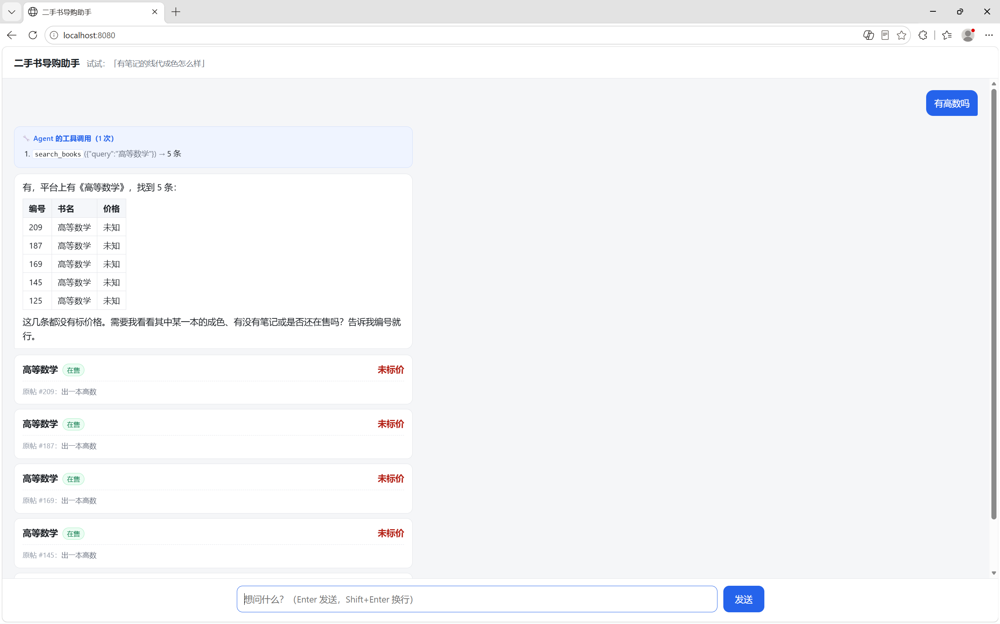
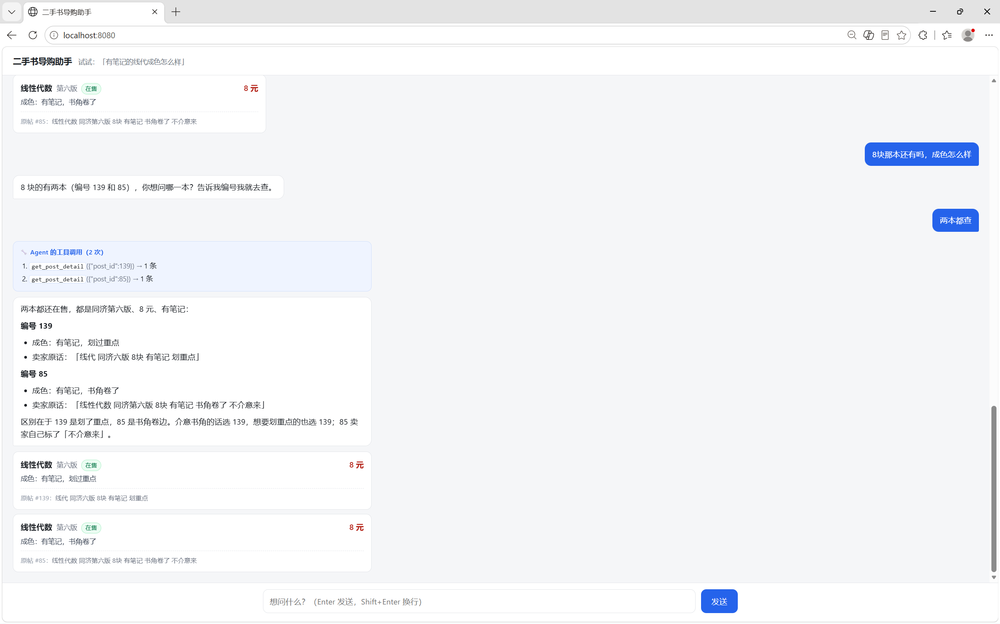
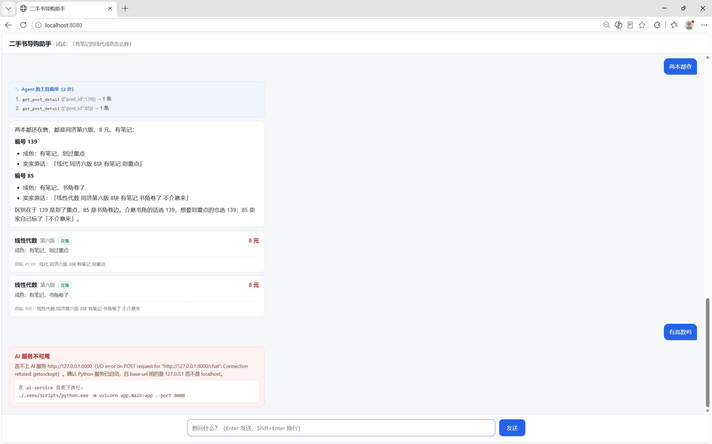

<p align="center">
  <h1 align="center">二手书智能匹配 Agent</h1>
  <p align="center">
    二手书群帖子 → 结构化抽取 → 向量语义检索 → 会自己调工具的对话 Agent<br>
    Java 24 / Spring Boot 4 主服务 + Python 3.14 / FastAPI AI 服务
  </p>
</p>

<p align="center">
  
  
  
  
</p>

大学二手书群里的帖子都是这种一句话：「带笔记的线代，15 出，有意私聊」。
这个项目把这类句子抽成结构化字段（书名、价格、有没有笔记、成色），
建向量索引做语义检索，上面再套一个会自己决定查不查库的对话 agent。

技术上是两条链路：RAG（抽取 → 向量化 → 检索）和 Agent（tool calling）。
CRUD 那部分没什么好讲的。

```
用户：「带笔记的线代，30 块以内」
  │
  ▼  模型自己拆参数，自己决定调哪个工具、调几次
  search_books(query="线性代数", has_notes=True, price_max=30)
  get_post_detail(post_id=...)
  │
  ▼
「《线性代数》有笔记，8 元，还在售。另外几本也有笔记，价格 8~15 元。」
```

---

## 目录

- [演示](#-演示)
- [架构](#-架构)
- [技术栈](#技术栈)
- [快速开始](#-快速开始)
- [接口一览](#接口一览)
- [关键设计决策](#关键设计决策)
- [文档](#文档)
- [目录结构](#目录结构)
- [开发日志](#开发日志)
- [常见问题](#-常见问题)

---

## 📸 演示

启动后打开 `http://localhost:8080`，是个聊天界面。

问「有笔记的线性代数，30 以内」，agent 自己去调 `search_books`，把书名、价格、成色列出来。
再追问「8 块那本还有吗，成色怎么样」——8 块的有两本，它会先反问要哪一本，确定了再去查。
这两句是实测能触发 `search_books` → `get_post_detail` 接力的问法。

页面上每次工具调用单独占一行，带工具名、参数、返回条数。下面第二张图是重点：
只放最终回答的话，看的人分不清「agent 自己决定查了库」和「硬编码了一段话」。







完整操作步骤见 `docs/演示流程.md`。

---

## 🏗 架构

```
            浏览器  ── POST /api/chat ──▶  主服务 :8080
                                              │
                                              │ HTTP 转发
                                              ▼
                                        AI 服务 :8000
                                              │
                        ┌─────────────────────┼─────────────────────┐
                        ▼                     ▼                     ▼
                   LLM 信息抽取          BGE 向量化            Agent 循环
                   （M1）                + Chroma（M2）        （M3）
                                              │                     │
                                              └──── 取业务数据 ─────┘
                                                       │
                                                       ▼
                                            回调主服务 REST API ──▶ MySQL
```

### 两个服务怎么分的

AI 服务不直连业务数据库。它要用帖子数据，就走主服务的 REST API。
这样它不持有任何状态，可以随便重启、随便扩副本，代价是每次多一跳 HTTP。

（LangChain 自带的会话历史有 InMemory / SQLite / Redis 三种，都要求自己存，
所以一个都没用上。历史存在主服务的 MySQL 里。）

反过来，校验、事务、状态流转也都归主服务。AI 服务只做「理解」这一件事：
文本进去，结构或者回答出来。

拆成两个服务不是必须的，但拆开之后每一边的职责都说得清：主服务是业务系统
（帖子、会话、事务），AI 服务是能力层（抽取、检索、对话），换模型或者换向量库
只动一边。

agent 的工具回调最能说明这个划分：代码上看是个普通函数，实际是一次跨进程 HTTP 调用。

---

## 技术栈

| | 技术 | 版本 | 备注 |
|---|---|---|---|
| 业务服务 | Java / Spring Boot | 24 / 4.1.1 | JDK 23+ 需显式配注解处理器（见 `pom.xml`） |
| | MyBatis-Plus | 3.5.17 | 必须用 `spring-boot4-starter`；`IService` 已从 `extension` 移到 `spring` 包 |
| | MySQL | 8.0 | |
| | springdoc | v3 | Boot 4 只能 v3，v2 起不来 |
| AI 服务 | Python | 3.14 | |
| | FastAPI + uvicorn | | |
| | LangChain | 1.x | 1.x 已移除 `AgentExecutor`，入口是 `create_agent` |
| | DeepSeek | `deepseek-chat` | OpenAI 兼容接口 |
| | BGE-small-zh-v1.5 | 512 维 | 本地跑，CPU 即可 |
| | Chroma | | 嵌入式向量库，跑在进程内 |
| 前端 | 原生 HTML + fetch | | 单文件，无构建步骤 |

**没有用到的**：Redis、消息队列、Docker。

---

## 🚀 快速开始

需要三个进程：**MySQL → 主服务 → AI 服务**，外加一个浏览器。

> 下面的命令以 **Windows** 为准（`net start MySQL80`、`.venv/Scripts/python.exe`）。
> macOS / Linux 只有这几处不同，其余照抄：
> - 起 MySQL：`brew services start mysql`（macOS）或 `sudo systemctl start mysql`（Linux）
> - 用 Python：`.venv/bin/python` 而不是 `.venv/Scripts/python.exe`

### 情况 A：数据库里已有数据（约 1 分钟）

```bash
# ① MySQL（Windows 上是手动启动的服务，重启机器后要重新起）
net start MySQL80

# ② 主服务
cd book-service && mvn spring-boot:run          # :8080，约 2 秒起来

# ③ AI 服务
cd ai-service
.venv/Scripts/python.exe -m uvicorn app.main:app --port 8000    # :8000

# ④ 打开浏览器
#    http://localhost:8080
```

### 情况 B：从零（首次，约 10 分钟）

```bash
# ① 建库建表
mysql -uroot -p < book-service/src/main/resources/db/schema.sql

# ② 填两个配置
cp book-service/src/main/resources/application-local.yml.example \
   book-service/src/main/resources/application-local.yml     # 数据库密码
cp ai-service/.env.example ai-service/.env                   # LLM_API_KEY

# ③ 装依赖（macOS/Linux 把下面两处 .venv/Scripts/python.exe 换成 .venv/bin/python）
cd ai-service
python -m venv .venv
.venv/Scripts/python.exe -m pip install -r requirements.txt \
    -i https://pypi.tuna.tsinghua.edu.cn/simple
# 注意：torch 要装 CPU 版。默认 pip 会拉 CUDA 版（2GB+），本机没 N 卡就是白下。
#    命令见 requirements.txt 顶部注释。

# ④ 造种子数据（220 条模拟帖子，要花模型调用）
.venv/Scripts/python.exe scripts/gen_mock_posts.py --count 220

# ⑤ 起两个服务（同情况 A 的 ②③）

# ⑥ 抽取：反复调这个接口直到 remaining 为 0（220 条约 40 秒）
curl -X POST http://localhost:8080/api/posts/extract-pending

# ⑦ 建向量索引（见下面的坑 1，这步不能跳）
curl -X POST http://localhost:8000/index/build
```

### 三个必踩的坑

**1. 新克隆后一定要跑 `/index/build`。**
向量库落在 `ai-service/data/`，而这个目录在 `.gitignore` 里 ——
**新克隆的仓库索引是空的**。不建索引的话 `search_books` 永远返回 0 条，
表现成「agent 说找不到任何书」，很容易误判成代码坏了。
（写入用的是 upsert，重复调这个接口是幂等的。）

**2. 服务间调用写 `127.0.0.1`，不要写 `localhost`。**
Windows 上 `localhost` 会同时解析出 IPv4 和 IPv6，而 uvicorn 只绑了 IPv4，
客户端可能先试 `::1` 然后失败 —— 表现成「服务明明起着却连不上」。

**3. 改完 Java 代码要重启。** 项目没装 devtools。

改 `src/main/resources/static/` 下的前端文件**也要重启**：页面实际读的是
`target/classes/static/` 里那份**副本**，不重启的话浏览器拿到的还是旧页面。
（`spring-boot:run` 的 `addResources` 默认是 `false`，不会把源码目录直接挂上 classpath。）

---

## 接口一览

字段细节一律以 Swagger 为准（从代码注解自动生成，**代码改了文档跟着改**）：

| 服务 | Swagger UI | OpenAPI spec |
|---|---|---|
| AI 服务 | http://localhost:8000/docs | http://localhost:8000/openapi.json |
| 主服务 | http://localhost:8080/swagger-ui.html | http://localhost:8080/v3/api-docs |

两个 spec 都能直接导入 Apifox / Postman / YApi。

### 主服务（:8080）

| 方法 | 路径 | 干什么 |
|---|---|---|
| POST | `/api/chat` | **前端唯一要调的接口**。转发给 AI 服务，不解析 body |
| GET/POST | `/api/chat/{sessionId}/messages` | 会话历史读写。**调用方是 AI 服务，不是前端** |
| GET | `/api/posts` | 帖子列表（`?extractStatus=DONE` 给建索引用） |
| GET | `/api/posts/{id}` | 帖子详情（agent 的 `get_post_detail` 回调它） |
| POST | `/api/posts` | 发布帖子（只传 `userId` + `rawText`） |
| POST | `/api/posts/extract-pending` | 批量抽取待处理帖子，反复调到 `remaining` 为 0 |

### AI 服务（:8000）

| 方法 | 路径 | 干什么 | 花模型调用 |
|---|---|---|---|
| GET | `/health` | 探活 | 否 |
| POST | `/chat` | **agent 对话**，带会话记忆 | 是（每轮 1~N 次） |
| POST | `/search` | 语义检索 | 否 |
| POST | `/extract` `/extract/batch` | 帖子 → 结构化字段 | 是 |
| POST | `/index/build` | 建向量索引 | 否 |

---

## 关键设计决策

完整论述在 [需求与接口](docs/需求与接口.md)，这里只列结论和理由：

| 决策 | 理由 |
|---|---|
| 检索文本不含价格和成色 | 向量只管「是哪本书」，条件过滤交给结构化字段。实测过：书名在检索文本里重复出现反而拉低分数（0.6258 → 0.6054 → 0.5953）；用「未知」占位填 `None` 也会毒化检索，全体掉 0.03~0.11 |
| 检索必须有相似度阈值 | 向量检索永远会返回 top_k 条，哪怕库里根本没有这本书 —— 搜「量子力学」也会返回一堆高数。所以阈值不是一个可以随便调的参数，它决定了检索结果能不能信 |
| 索引里只存 id 和列表页字段 | 向量库当索引用，不当副本。详情回主服务取，省掉双写一致性的麻烦 |
| 三态字段（有没有笔记、价格）不在出口压成两态 | 卖家「没提」和「说了没有」不是一回事。用 `bool(None)` 会把 220 条里的 99 条「没提」压成「没有笔记」，等于替卖家撒谎 |
| 每轮只存两条历史 | agent 一轮跑完返回的是整段会话，整个存回去会一轮比一轮重复。只留 `HumanMessage` 和最后那条 `AIMessage` —— 中间的工单和回执必须成对，只留一半下一轮直接报错 |
| `recursion_limit = 12` | 实测 N 轮工具调用 = 2N+1 个节点，上限至少得 2N+2。`MAX_ROUNDS=5` 反推出 12（默认 10007，等于没有护栏） |
| 前端单文件、不引框架 | 这一页只做「发请求 + 渲染 JSON」。上构建工具链对要演示的东西（agent 会不会自己调工具）没任何帮助 |

---

## 文档

| 文件 | 内容 |
|---|---|
| [项目全景.md](docs/项目全景.md) | 模块地图、设计决策、关键数字速查表 |
| [需求与接口.md](docs/需求与接口.md) | 每个里程碑的目标、接口契约、决策点、验收标准 |
| [演示流程.md](docs/演示流程.md) | 2 分钟演示脚本、演示前清单、翻车预案 |

---

## 目录结构

```
agent-book/
├── book-service/                  # Spring Boot 主服务（IDEA 打开）
│   └── src/main/
│       ├── java/com/book/
│       │   ├── client/            # 调 AI 服务的客户端（唯一知道 AI 服务存在的地方）
│       │   ├── controller/        # REST 接口
│       │   ├── dto/               # 请求 / 响应体
│       │   ├── entity/ mapper/ service/
│       │   └── exception/         # 统一异常出口
│       └── resources/
│           ├── db/schema.sql
│           └── static/index.html  # 前端页面
├── ai-service/                    # Python AI 服务（VS Code 打开）
│   ├── app/
│   │   ├── agent/                 # tools.py（工具定义）+ loop.py（agent 循环）
│   │   ├── clients/               # 调主服务的 HTTP 客户端
│   │   ├── services/              # extract / embedding / vector_store / search / llm
│   │   ├── main.py                # FastAPI 入口
│   │   └── schemas.py             # 请求 / 响应模型
│   └── scripts/                   # 30 个开发脚本（验收 / 实验 / 复现）
└── docs/                          # 项目全景 / 需求与接口 / 演示流程
```

`ai-service/scripts/` 里是 30 个开发期脚本，服务跑起来用不到它们，大致分三类：

- `try_*.py`：单点验证（`try_search_books.py`、`try_tool_call.py` 等），
  调一次接口看返回，用来定位问题
- `try_continue_bug.py`、`try_post_ids_bug.py`、`try_framework_scan_bug.py`、
  `try_hallucinated_tool.py` 这几个是复现具体 bug 的最小用例，修完之后留着当回归脚本
- `eval_search.py`、`compare_agent.py`、`walk_agent_loop.py`：批量评测和循环跟踪

每个脚本的文件头都写了**花不花钱**（是否真的调模型）和跑法，可以先挑不花钱的跑。

---

## 开发日志

| | 做了什么 | 实测结果 |
|---|---|---|
| **M1** | 抽取落库 | 220/220 全部 DONE，零失败，不到 40 秒 |
| **M2** | 语义检索 | 16/16 测试用例通过，阈值 0.60 |
| **M3** | Agent（手写循环 + 框架对照两版） | 验收 6/6。框架版反而多 5 行（38 vs 43），省下的主要是协议坑那部分 |
| **M4** | 打通前端 | 5/5。单文件页面 + `POST /api/chat` 转发 |
| **M5** | 打磨 | 边界/压测跑完（13 个畸形输入全 400；30 并发 `/search` 逐字节一致）；补齐文档 |
| **M6** | 教材 PDF 切块问答 | 弹性目标，未开始 |

M1–M5 是计划内；M6 是我给自己留的弹性目标，没做也不影响前面几块。
每一块做完都留了可复现的验证结果（就是上面那一列），不是"写完了"就划掉。

---

## ❓ 常见问题

**Q：为什么不直接用 `LIKE` 做关键词检索？**

因为「同济版高数」和「高等数学 同济大学出版社」字面上没有公共子串。
实测：库里有 12 条《高等数学》时，`book_name LIKE '%高数%'` 命中 **0** 条。

**Q：检索为什么一定要有相似度阈值？**

向量检索**永远**会返回 top_k 条，哪怕库里根本没有这本书。
搜「量子力学」在默认阈值下返回 0 条；把阈值放到 0，会返回 5 条《高等数学》——
相似度全是 **0.4819**。所以它不是一个可以随手调的参数，它决定检索结果能不能信。

**Q：索引里为什么不存价格和成色？**

向量只负责回答「是哪本书」，条件过滤交给结构化字段。实测过两件事：
书名在检索文本里重复出现反而**拉低**分数（0.6258 → 0.6054 → 0.5953）；
用「未知」给空字段占位会毒化检索，全体掉 0.03~0.11。

**Q：换一个 LLM 要改多少？**

三行。`ai-service/.env` 里的 `LLM_MODEL` / `LLM_BASE_URL` / `LLM_API_KEY`。
走的是 OpenAI 兼容接口，DeepSeek、通义、本地 vLLM 都能接。

**Q：agent 为什么手写循环，不用 LangChain 的 `create_agent`？**

两版都在 `ai-service/app/agent/loop.py` 里（`chat_once` 和 `chat_once_framework`），
可以直接对着看。实测手写 **38 行**、框架 **43 行**（都不含 docstring）——
框架省掉的是 `bind_tools`、工单↔回执配对这些协议细节，不是行数。

**Q：能不用 MySQL 吗？**

不能。会话历史存在主服务的 `chat_message` 表里——AI 服务自己确实不连数据库，
但它要用历史就得走主服务的接口。这也是 LangChain 自带的 InMemory / SQLite / Redis
三种会话存储一个都没用上的原因：它们都要求 AI 服务自己存。

---

## 作者

[kurukurumi-33](https://github.com/kurukurumi-33)

---

## License

[MIT](LICENSE)。随便用，包括商用。里面没有别人的私有代码，
`ai-service/scripts/gen_mock_posts.py` 生成的 220 条帖子是**用模型编的假数据**，
不含任何真实交易或个人信息。
